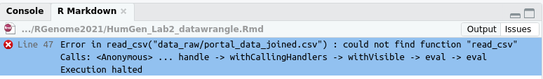

## Learning objectives

* Using R Markdown to 
* Understanding R packages and libraries 
* Reading and manipulating tables with tidyverse
* Making nice tables for your lab reports

## A more comprehensive look at R Markdown

In Lab one we used a single R Markdown file to both save and execute code and generate a lab report. Today we will spend more time understanding R Markdown using a set of [R Markdown tutorials](https://rmarkdown.rstudio.com/index.html)

## R packages and libraries

There are many R packages (add-ons) that provide additional functionality to the Base R installation that we worked within in Lab 1. To use these packages after installing them we must first load the libraries for the packages. Here is a nice introduction from the Harvard Chan Bioinformatics Core on [R Packages and Libraries](https://hbctraining.github.io/Intro-to-R-flipped/lessons/04_introR_packages.html). 

### Installing R packages

__If you are using RStudio Cloud in the HumGen Workspace the necessary packages for the labs should be preinstalled__

If you are using R on your own computer, Unity or even a separate RStudio Cloud Workspace, you must install the additional packages. You can search for ones that have been registered in the CRAN repository through the RStudio menu bar by clicking on Tools > Install Packages and searching for the package. Check the box to install dependencies. 'tidyverse' does not come with the core R installation, so to work with it you must install the package.  

If you are installing R packages from source code (as we will do later in the course), first install the `devtools` package. I recommend doing this now. Check out this [Data Camp Tutorial](https://www.datacamp.com/community/tutorials/r-packages-guide) for more details on installing R packages. 

### Working the the packages - loading libraries

Simple!!!

```{r, message=FALSE}
library(tidyverse)
```

...but it is easy to forget this step. Which will result in an error message when you try to use the libraries' functions.

...also even when you have loaded the library in your working environment. When you Knit an R Markdown file it only uses libraries loaded in the file so if you don't specifically load a library in the R Markdown file you will get an error meassage when Knitting in which the function that is part of the library could not be found.  __This is a very common error__

```{r, eval=FALSE}
surveys <- read_csv("data_raw/portal_data_joined.csv")
```


I recommend putting loading all libraries need at the beginning of the R Markdown document

##  Overview of tidyverse 
In R and most programming languages there are many ways to do the same thing. In the past I have taught R using the core syntax. A newer approach to learning to program in R is embodied by the [tidyverse](https://www.tidyverse.org/). The tidyverse packages are designed flatten the learning curve for data transformation, analysis and graphing. This approach is conducive to course like ours.

### Import

* `readr` - readr provides a fast and friendly way to read rectangular data (like csv, tsv, and fwf). It is designed to flexibly parse many types of data found in the wild.

### Data Wrangling

* `dplyr` - dplyr provides a grammar of data manipulation, providing a consistent set of verbs that solve the most common data manipulation challenges. 

* `tidyr` - tidyr provides a set of functions that help you get to tidy data. Tidy data is data with a consistent form: in brief, every variable goes in a column, and every column is a variable. 

* `stringr` - stringr provides a cohesive set of functions designed to make working with strings as easy as possible. 

### Graphing

* `ggplot2` - ggplot2 is a system for creating graphics, based on The Grammar of Graphics. 

### Programing

* `purrr` - purrr enhances R’s functional programming (FP) toolkit by providing a complete and consistent set of tools for working with functions and vectors. Once you master the basic concepts, purrr allows you to replace many for loops with code that is easier to write and more expressive.

The free online book [R for Data Science](https://r4ds.had.co.nz/) is a one place offers a introduction to the `tidyverse` and is great source of alternate examples, explanations and workflows for this course

### Basic data types and data objects

We will load the `tidyverse` for the below examples

```{r, message=FALSE}
library(tidyverse)
```

The last lab we learned about data types in R and vectors, one of the most important object types in R.  This session we will more in data types and objects

Vectors are ordered collections of the same data type (numeric, character, complex, raw and logical values).  You can assemble and combine vectors using the function "c" short for combine. As we saw last week it matters as to whether you have parenthesis around your data. To check on an object type use `str`

```{r}
x <- c(1, 2, 3, 4)
str(x)
```

If we use parentheses 
```{r}
a <- c("1", "2", "3", "4")
str(a)
```

The numbers are read into the vector as characters. It is important to also note the distinction between reading data objects vs characaters.

```{r}
x <- c(1, 2, 3, 4)
y <- c(2, 4, 6, 8)
z <- c(x, y)
str(z)
```

A common error is for people to read in characters but forget the parentheses

```{r, eval=FALSE}
b <- c(A, B)
```

This will results in `Error: object 'A' not found`

### Factors

A Factor is a vector whose elements can take on one of a specific set of values. Factors encode categorical data, such as the days of the week or a range (e.g. low, medium, high) The set of values that the elements of a factor can take are called its levels. 

```{r}
SNPs <- c("AA", "AA", "GG", "AG", "AG", "AA","AG", "AA", "AA", "AA", "AG")
str(SNPs)
```

We can see that the data type is `chr` character.
We can covert it to a factor.

```{r}
SNPs_cat <- as_factor(SNPs)
str(SNPs_cat)
```

In the following example, there are 3 levels (AA AG GG).  The Environment window in the top right corner of RStudio will also display the value types.

Another important distinction is between `integers` and `numbers` (often called doubles in tiyverse). See [Column data types](https://tibble.tidyverse.org/articles/types.html#overview-1) for a comprehensive list. Data types are also called atomic modes in R. The are built in objects like factors and dates for convience.  

## Reading files with tidyverse 

It is important to understand data and objects types, particularly when we are importing data. R will try to try to make a best guess, but it is up to you to make sure the data read into R as you would like.

All the data files for a lab will be in your RCloud project `data` directory. To import a file you must include the correct location of the file relative to where your .Rmd file is located. Today we will take a look at data downloaded from the [UMass COVID Dashboard](https://www.umass.edu/coronavirus/dashboard)

```{r}
UMass_COVID_data <- read_csv("data/UMass_COVID_Data.csv")
```

When we read in the data R let's us know the data types in the Column specification. We can also use `str` and the data types can also be seen by looking at your "Environment" in the top left frame in RStudio. Note that the first colum is read in as a data, but all others are numbers (doubles). We could quibble with this tibble in that some values could be integers, but that is not important for us today.

```{r}
str(UMass_COVID_data)
```

Now let's try to read in a SNP genotype file from 23andMe. Since the file is very large we will first work with a concatenated file with just 25 lines at the begining. First click on the file in 25andMe_cat25.txt in your data directory to open it. Notice that the first 14 lines contain information about the file and have hash tags #. `rsid` numbers can be linked to data in NCBI's [SNP database](https://www.ncbi.nlm.nih.gov/snp/rs4477212) and other resources.

The data follows in tab separated columns. To read this into R using `read_tsv` (tab separated values) and ignore the comment lines containing #.

```{r}
mySNPs_cat25 <- read_tsv("data/23andMe_cat25.txt", comment = '#')
```

Note that the `rsid` and `genotype` columns formatted as characters and `chromosome` and `position` as numbers. We are most often going to want to work with `genotype` and `chromosome` as factors. We can specific these when importing the data.

```{r}
mySNPs_cat25 <- read_tsv("data/23andMe_cat25.txt", comment = '#',
col_types = 
  cols(
    rsid = col_character(),
    chromosome = col_factor(),
    position = col_integer(),
    genotype = col_factor()
  ))
```

Now let's try with the complete 23andMe file. 

```{r}
mySNPs_all <- read_tsv("data/23andMe_complete.txt", comment = '#')
```

As above the the `rsid` and `genotype` columns formatted as characters and `chromosome` and `position` as numbers, but there is also a warming message regarding parsing failures. Open the `mySNPs_all` data object in our Global Environment. Scroll all the way to the end and you will see that some of the chromosome data was read in as `NA`. Hmm looking at the file, I can see this should be MT (for mitochondrion). However, since R decided `chromosome` was a number (double) it rejected data that was encoded as characters and turned that data into `NA`s.  This are some of the real world data wrangling challenges we will face in this class. Let's use the import format we used above with the smalller data set.

```{r}
mySNPs_all <- read_tsv("data/23andMe_complete.txt", comment = '#',
col_types = 
  cols(
    rsid = col_character(),
    chromosome = col_factor(),
    position = col_integer(),
    genotype = col_factor()
  ))
```

Walla! No warming message and if you open `mySNPs_all` and scroll to the bottom `MT` is now read properly.

## A first introduction to data manipulation

Data manipulation for making graphs and statistical analyses is a big part of this course. Today we will touch upon a few of the basics using the above data. Check out [dplyr vignettes](https://cran.r-project.org/web/packages/dplyr/vignettes/dplyr.html) for more examples. Manipulting data in the `tidyverse` uses pipes `%>%` to chain together steps. So if we want to filter the `UMass_COVID_data` to cases greater than 50. In this case we are not changing what is in the `UMass_COVID_data` data object

```{r}
UMass_COVID_data %>% 
  filter(cases > 30) 
```

Or using the date

```{r}
UMass_COVID_data %>% 
  filter(collection_date >= '2021-02-01')
```

We can string them together

```{r}
UMass_COVID_data %>% 
  filter(collection_date >= '2021-02-01') %>% 
  filter(cases > 30) 
```

To find the total number of cases since reporting began

```{r}
UMass_COVID_data %>%
  summarise(total_cases = sum(cases))
```

If we wanted to make a new column with the number of cases detected per number of tests

```{r}
UMass_COVID_data %>%
  mutate(detection = cases/tests)
```

To select a subset of columns

```{r}
UMass_COVID_data %>%
  select(collection_date, tests, cases)
```

Note that none of the above creates a new data object. To do this and display

```{r}
UMass_COVID_data_filter <- UMass_COVID_data %>% 
  select(collection_date, tests, cases) %>% 
  filter(collection_date >= '2021-02-01') %>% 
  filter(cases > 30) %>% 
  mutate(detection = cases/tests)
UMass_COVID_data_filter
```

Some more examples using the 23andMe data. To count the sum of each level in a factor.

```{r}
mySNPs_all %>% 
  count(genotype)
```

However, count does not work within `summarize` See `tidyverse/dplyr` documentation for [Count observations by group](https://dplyr.tidyverse.org/reference/count.html). Instead use `n()`. Hint: this is important for one of the exercises.

```{r}
mySNPs_all %>% 
  group_by(genotype) %>% 
  summarise(genotype_count = n())
```

To sort
```{r}
mySNPs_all %>% 
  arrange(-position)
```

To group be a particular column for calculations 
```{r}
mySNPs_all %>% 
  group_by(chromosome, genotype) %>% 
  count(genotype)
```

## Making tables in R Markdown reports

You can make tables using `knitr`

```{r}
library(knitr)
kable(UMass_COVID_data[1:10, ], caption = "COVID-19 testing conducted on the UMass community ")
```

This works well for small tables, but for even moderate tables like above it takes up a lot of space. In the above example I have limited the table to just the first 10 rows. This gives the reader of the report an idea of what is in the larger data table.

A better option is using the DT package, but *** Don’t do this with tables of hundreds of thousands of rows (as in your complete SNP table).

```{r}
library(DT)
datatable(UMass_COVID_data)
```

We can click on the table to reorganize the data. If we sort the `cases` the highest 4 are the last 4 weekday reporting days. Yikes. Fingers crossed for today. 

## Exercises

Use the 23andMe Commplete data set (mySNPs_all) for the exercises

### Exercise 1

Subset (select) the 23andMe Complete table to just position and genotype

### Exercise 2

Filter to just the MT chromosome and remove genotypes A and T. (you can use != to remove).

### Exercise 3

Use group_by() and summarize() to find the min positon, max position and number of positions (SNPs) measured for each chromosome. Note that each position represents a SNP, therefore the number of SNPs for a chromosome = the number of positions measured on each chromosome. 

### Exercise 4

Building on ex3 create using mutate a new column with the density of SNPs for each chromosome based the total number of SNPs divided by the max position - min position

### Exercise 5

Building on ex3 sort chromosomes based on SNP density.

### Exercise 6

Make a table for your report using DT to show SNP density


