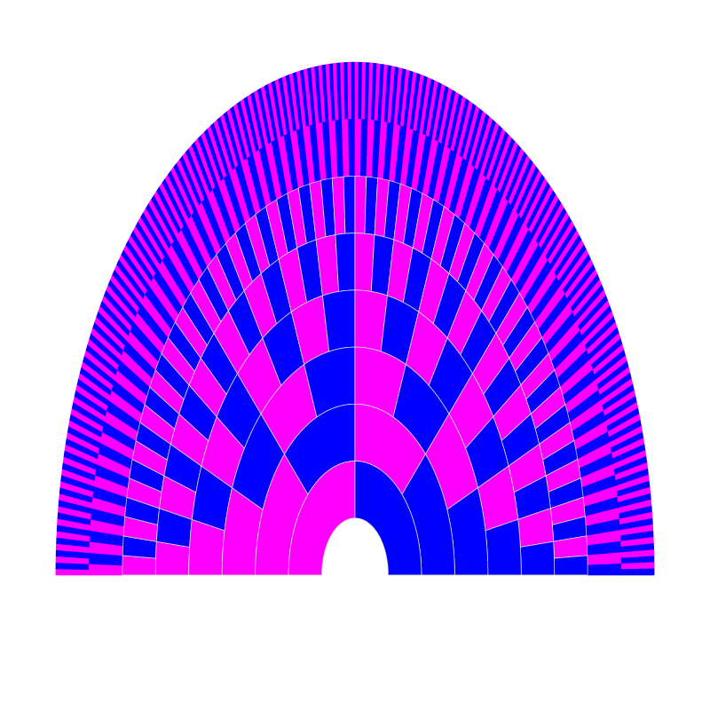
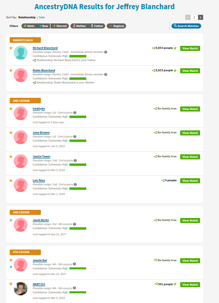
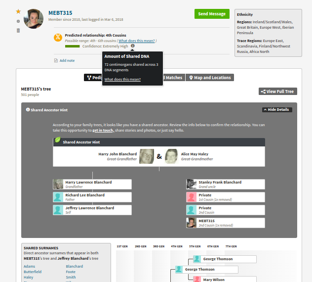
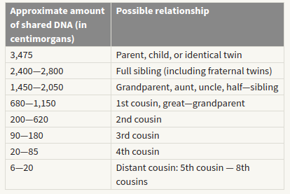
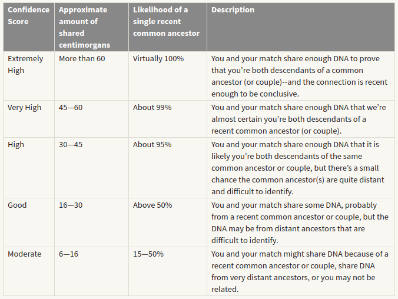
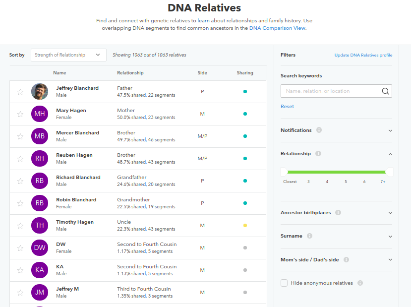
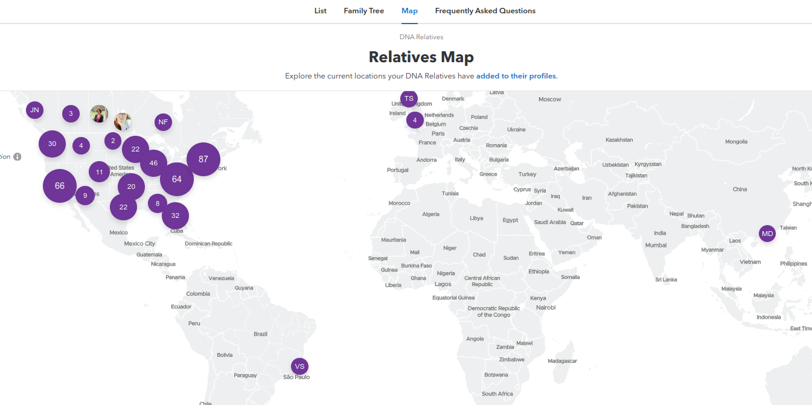

## Learning Objectives

* Understand the difference between genetic and genealogical ancestors
* Learn to use online Genealogy resources
* Construct a genealogy of yourself or someone you know 

# Genetic vs genealogical ancestors

The chart below shows a family tree radiating out from one individual. Each successive layer out shows an individual’s ancestors another generation back in time, parents, grandparents, great-grandparents and so on back (magenta for female, blue for male).

The number of genealogical ancestors you have in n generations is 2^n: 2 parents, 4 grandparents, 8 great-grandparents, and so forth until you are descended from so many people (e.g. 20 generations back you potentially have 1 million ancestor) that it is quite likely that some people back then are your ancestors multiple times over. 

How quickly then does your number of genetic ancestors grow, i.e. those ancestors who contributed genetic material to you? The difference between genealogical ancestors and genetic ancestors is that genetic ancestors are the ones that you actually got some DNA from. They're a subset of your genealogical ancestors. Humans have about 3 billion base-pairs of DNA, so that limits the number of genetic ancestors to about 3 billion no matter how far back you go. There are around 46,000 recombincation hotspots, places where crossovers usually happen. Each of the 46,000 segments bounded by neighboring hotspots usually has a single line of descent, so you're limited to about 46,000 genetic ancestors.

After about eight generations back, the number of genetic ancestors only increases linearly with the number of generations, while the number of genealogical ancestors keeps increasing exponentially. Once you go back 20 generations, you have only 1300 or so genetic ancestors despite having over a million genealogical ancestors.

The exponential growth up to 8 generations is due to having many independent chromosome pairs. Humans have 23 pairs of chromosomes, and which side of the pair you inherit from is a random choice for each of the chromosomes. You start out with both sides of the pair yourself. For your parents, you got one side of each of the 23 pairs from each parent. Grandparents, that's about one side of 23/2=12 pairs. Great-grandparents, one side of 6 pairs each. Great-great-grandparents, one side of 3 pairs. Eventually you're down to inheriting DNA on just one side of one pair from each ancestor. At that point the exponential growth of ancestors stops.

The linear growth after that is a bit more complicated. The linear growth is due to having a limited number of crossovers per chromosome per generation. Each generation, you don't just get one side of one of your parent's chromosomes. Instead, the parent mixes their pair before splitting it into two (meiosis). The points where the pairs cross are called crossovers. There's around one or two crossovers per chromosome pair per generation.

The 23rd chromosome is special, it's the XY chromosome. If you're a male you have XY, if you're female you have XX. The male does not mix the XY, daughters get the X directly and sons get the Y directly. If you're female you have XX, and XX has about as many crossovers as any other chromosome. Other than that, there's always at least one crossover per chromosome per generation (otherwise meiosis doesn't work properly), and sometimes more than one. How many more is proportional to the length of the chromosome. If you're male, you have an average of 26.4 crossovers total when producing sperm, so spread among 22 chromosomes, that's a little over 1 crossover per chromosome. If you're female, it's more like an average of 41.1 crossovers when producing eggs, so given 23 chromosomes total, that's a little under 2 crossovers per chromosome. 

If you're male, you got your Y chromosome from exactly 1 ancestor n generations back. The X chromosome (men have half a pair, women have a whole pair) is also unusual: you're most likely to get it from your mother's father's mother's father's mother etc, but it might have come from your mother's mother's etc. 

However over time you do not inherit an equal amount of DNA from each ancestor. Here is a plot of the number of genetic ancestors compared to genealogical ancestors over generations.

Your number of genetic ancestors will not grow linearly forever. If we go far enough back your number of genetic ancestors will get large enough, on order of the size of the population you are descended from, that it will stop growing as you will be inheriting different chunks of genetic material from the same set of individuals multiple times over. At this point your number of ancestors will begin to plateau. Indeed, once we go back far enough actually your number of genetic ancestors will begin to contract as human populations have grown rapidly over time. 

# Genetic Ancestors - DNA matching

All of the DNA testing services offer the option of comparing your DNA seqeunces to others in their database. This is particularly useful for identifying people with common ancestors in the last 5-8 generations. As you can see in the graphs above, just because you don't share DNA after 3-4 generations, does not mean you are not related. Conversely if you share some small blocks of DNA it does not mean you have a common ancestor. 

The two companies with the largest databases, Ancestry and 23andMe, do not allow for DNA results from other companies to be uploaded. However, the smaller companies (MyHeritage, Geni, FamilyTreeDNA) allow for 23andMe results to be uploaded to their databases. 

### DNA matching on Ancestry

Here is an example of the top level of DNA matches on Ancestry. 

If both you and the person you share DNA with have built trees on Ancestry and if both trees contain a common ancestor, Ancestry will show you the most recent common ancestor.

You can see hom much DNA you share by clicking on the "i" link shown above. This is my second cousin 1x removed (the daughter of my 2nd cousin). If you click on the "what does this mean?" link you can get more information on how Ancestry relates shared centimorgans to the relationship. In this example Megan and I share much less DNA than would be expected based on our geneaology. This is often because DNA is inherited in blocks and the number of generations between two people increases there is larger variation in the shared DNA due to the number and size of blocks inherited.

Below is an explanation of the confidence scores/categories Ancestry uses. Note that at the "moderate" level there is some probability that a match may not be a relative.

You can read more about DNA matching on Ancestry https://www.ancestry.com/dna/resource/whitePaper/AncestryDNA-Matching-White-Paper.pdf

## DNA matching on 23andMe

23andMe also provides a list of shared matches to their database and calculates percent relatedness and the family relationship. 

Until recently 23andMe did not have a geneaology service (see below for the beta software)  However, it does have features not included on the Ancestry site like a chromosome browser to visual the position of the shared matches. Below is a son in relationship to his parents. Not surprising he inherited his X chromosome from his mother.

Below is his relationship to his grandparents. Due to recombination he has inherited parts of most chromosomes from both grandparents, but for some of the small chromosomes he only has matches to one grandparent.

Below is his relationship to his brothers. He can see the sections of DNA where he shares SNPs and the areas where his is unique.

## 23andME family tree and map

Your 23andMe results will include a new software tool that will predict your genetic relationships and build a tree. 

While it is a good place to start, it is still in development (I can't move the image in one of my browsers and it keeps deleting the information I have added) and not always accurate. Why not just build your tree on your own from your family historical data and other online resources? 

23andMe also includes a map of relatives you share DNA with. Not surprising mine are mostly in the US because that is 23andMe's customer base and many of my ancestral lineages go back to the 1600s. 

# Genealogies

One of life’s biggest mysteries, “where did I come from?” is now a puzzle almost anyone can piece together, at least when it comes to your ancestry. With the evolution of the Internet, genealogy has become a hot hobby. Genealogy is now the second most popular hobby in the U.S. after gardening, and the second most visited category of website. It's a billion dollar industry that has spawned television shows, scores of books and the advent of over-the-counter genetic test kits. Constructing a genealogy will be useful in this class for interpreting 23andMe ancestry and trait-based results. There are many resources available not only the ones mentioned in the online sites, but Google, Facebook and the White Pages.

## Popular Web Sites and Open Source Software for Constructing Genealogies

Open Genealogy Software

* <a href="https://gramps-project.org/" target="_blank">GRAMPS Open Source Genealogy Software</a>
* <a href="https://gramps-project.org/wiki/index.php?title=Start_with_Genealogy" target="_blank">Getting started with Gramps</a>
 

Online Genealogy Software and Resources

* <a href="https://www.wikitree.com/" target="_blank">WikiTree</a> Free
* <a href="https://www.familysearch.org" target="_blank">Family Search</a> Free
* <a href="http://www.ancestry.com" target="_blank">Ancestry</a> Free 14 day trial (subscription afterwards)
* <a href="http://www.myheritage.com" target="_blank">MyHeritage</a> (Free Basic Plan with 100 members)

## GEDcom files

GEDCOM (GEnealogical Data COMmunications) is a data structure created for storing and exchanging genealogical information so that many different computer programs can use it. It is identified by the file type ".ged". GEDcom files are text files that contain the information and linkages necessary to exchange genealogical data between two entities. The entities may use the same or different software application. As a text-based file, it is easily transmitted as an attachment to e-mails or downloaded from web sites. Most programs for family history can export and import GEDCOM (.ged) files. For example a genealogy constructed on Ancestry can be downloaded and opened in GRAMPS (or vice versa).

GEDcom import/export instructions

* <a href="https://support.ancestry.com/s/article/Uploading-and-Downloading-Trees" target="_blank">Ancestry GEDcom Import/Export</a>
* <a href="http://www.myheritage.com/help-center#/path/951685261" target="_blank">MyHeritage GEDcom Import/Export</a>

## Acknowledgements

The R code and some text is courtesy [Graham Coop](https://gcbias.org/). Other text was paraphrased from Bob Burttle.

# Exercises

## Exercise 1

Use the provided Rmd HumGen_Lab5_genetic_ancestors_code.Rmd file. Participants working on their own computer will need to also download the files in R_helper on the course github. Make new graphs of back 6, 8, 10 and 12 generations. You are going to need to change the legend text size as you add generations. Discuss the pattern of inheritance you observe. This is the only file to hand in today.

## Exercise 2

This is also a good time to learn more about your families genealogical and medical history. The Ancestry online database includes census, birth and death, marriage and other records. The US Census is particularly useful in the US for 1850-1950, for identifying family members living together. Ancestry includes recent (last 50 years) phone and address related records.  The UMass libraries has [genealogical sources](https://guides.library.umass.edu/genealogy), including access to the [Ancestry database](https://www.ancestrylibrary.com/) (but it does not automatically add records to your tree). This is useful once your free Ancestry subscription expires.  I also have used Facebook and Public Records 360 to find recent living relations - http://www.publicrecords360.com/. If you are adopted, feel free to use your adopted parent's genealogy. 

Construct a genealogy going back 4 generations of yourself or the DNA testing kit you are working with. Use Ancestry (you can use the resources on other sites) or GRAMPS to make the genealogy. If you anticipate having problems putting the genealogy together for any reason please contact me. Include images of this tree in your final report (due at the end of the semester).

